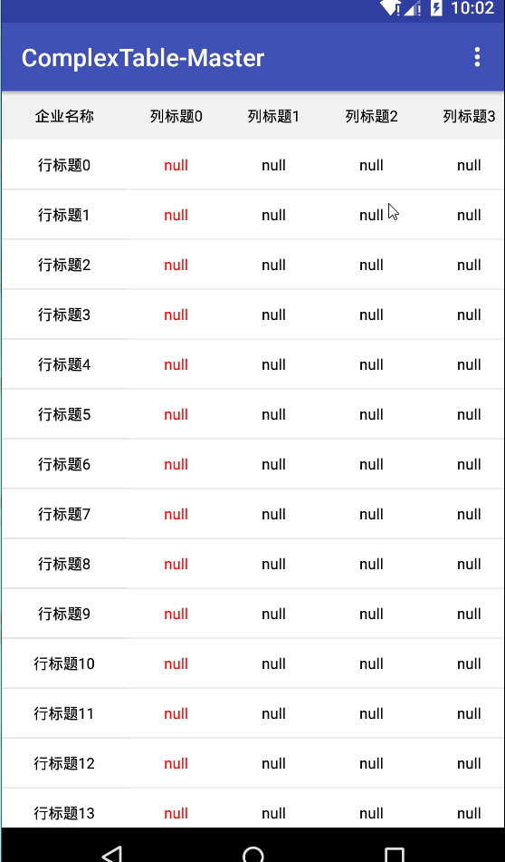
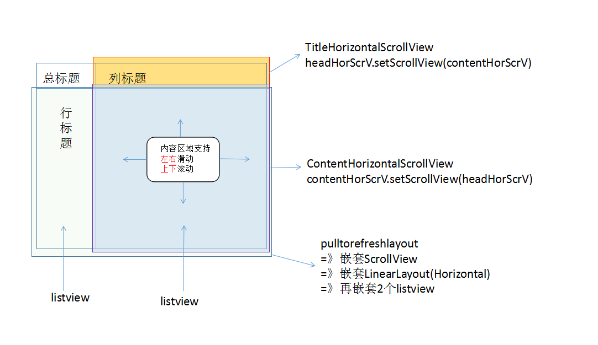

# ComplexTable-Master

这个项目实现了复杂表格，表格内容区域可以与上下滑动、左右滚动，并且标题会跟着滚动。

### 运行效果

<a href="./art/display.gif"></a>

### 思路图示

<a href="./art/inspiration.png"></a>

### 联系我

* 新浪微博：[@leafseelight](http://weibo.com/leafseelight)
* Email：ye.jg@outlook.com

### 如能荣幸给您带来帮助，并且乐意的话，可以在Demo中关于我的界面，支持一下我→ 微信or支付宝orPaypal

* <a href="./art/wechatpay.png"></a>
* <a href="intent://platformapi/startapp?saId=10000007&clientVersion=3.7.0.0718&qrcode=https://qr.alipay.com/aex03674qm0prhhrtepjcbb&_t=1472443966571#Intent;scheme=alipayqr;package=com.eg.android.AlipayGphone;end">支付宝打赏</a>
* <a href="https://www.paypal.me/yejg">Paypal.me</a>

### Thanks

 * [AlipayZeroSdk](https://github.com/fython/AlipayZeroSdk)
 * [Android实现Excel表格，且表格能左右、上下滑动](http://www.cnblogs.com/begin1949/p/5910785.html)

### License

```
Copyright 2016 leafseelight

Licensed under the Apache License, Version 2.0 (the "License");
you may not use this file except in compliance with the License.
You may obtain a copy of the License at

    http://www.apache.org/licenses/LICENSE-2.0

Unless required by applicable law or agreed to in writing, software
distributed under the License is distributed on an "AS IS" BASIS,
WITHOUT WARRANTIES OR CONDITIONS OF ANY KIND, either express or implied.
See the License for the specific language governing permissions and
limitations under the License.
```